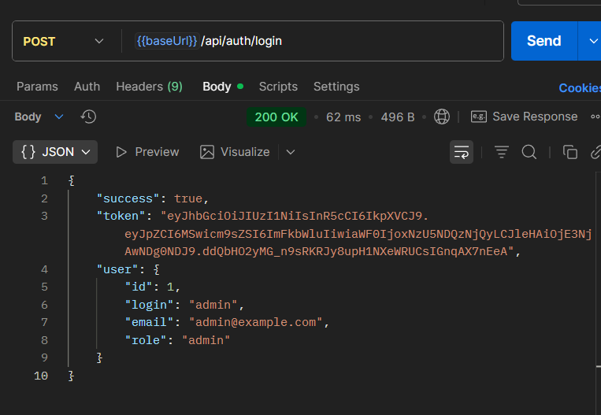
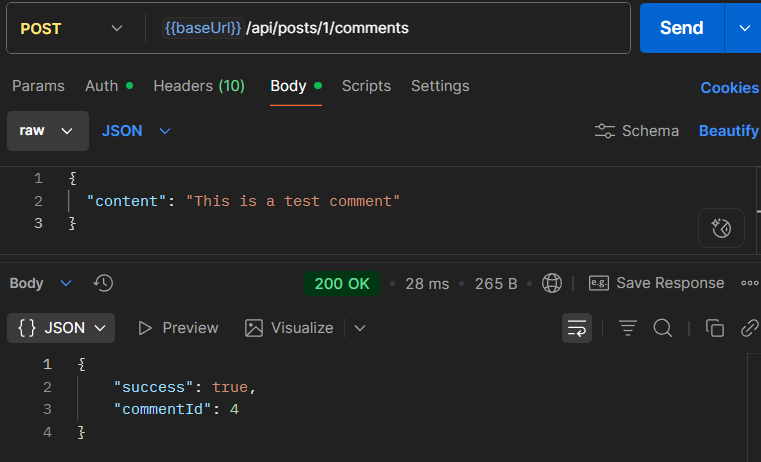

# USOF API

A comprehensive forum API built with Node.js, Express, and MySQL. RESTful API for a modern question-answer platform similar to Stack Overflow.

## 📸 Testing with Postman


### Postman Setup Guide

#### 1. Install Postman
- Download from [postman.com](https://www.postman.com/downloads/)
- Create free account (optional but recommended)

#### 2. Create Collection
- New → Collection → Name: "USOF API"

#### 3. Setup Environment
- Environments → New Environment → Name: "USOF Local"
- Variables:
  - `baseUrl` = `http://localhost:4000`
  - `token` = (leave empty, will be filled after login)

#### 4. Essential Test Requests

**Health Check**
```
GET {{baseUrl}}/health
```

**Admin Login** (Save token from response!)
```
POST {{baseUrl}}/api/auth/login
Headers: Content-Type: application/json
Body: 
{
  "loginOrEmail": "admin",
  "password": "password"
}
```

**Get All Posts**
```
GET {{baseUrl}}/api/posts
```

**Create Post** (Requires token)
```
POST {{baseUrl}}/api/posts
Headers: 
  Content-Type: application/json
  Authorization: Bearer {{token}}
Body:
{
  "title": "Test Post",
  "content": "Test content",
  "categories": [1, 2]
}
```

**Add Comment** (Requires token)
```
POST {{baseUrl}}/api/posts/1/comments
Headers: 
  Content-Type: application/json
  Authorization: Bearer {{token}}
Body:
{
  "content": "This is a test comment"
}
```

## 🚀 Key Features

- **Authentication & Authorization** - JWT-based auth with admin/user roles
- **Posts & Comments** - Full CRUD operations with likes/dislikes
- **Categories & Search** - Organize and find content easily
- **Advanced Features** - Favorites, subscriptions, notifications
- **Admin Panel** - Content moderation and user management
- **Security** - Password hashing, input validation, SQL injection protection

## 🛠 Installation & Setup

### Prerequisites
- Node.js (v16+)
- MySQL (v8+)
- npm (v7+)

### Quick Start
```bash
# 1. Clone repository
git clone https://github.com/Butterfly2112/USOF.git
cd USOF

# 2. Install dependencies  
npm install

# 3. Setup environment
cp  .env
# Edit .env with your database credentials

# 4. Initialize database
mysql -u root -p < init.sql

# 5. Start server
node server.js
```

Server runs on `http://localhost:4000`

### Environment Variables (.env)
```env
PORT=4000
DB_HOST=localhost
DB_USER=root
DB_PASSWORD=your_password
DB_NAME=usof_db
JWT_SECRET=your_secret_key
EMAIL_HOST=smtp.gmail.com
EMAIL_USER=your-email@gmail.com
EMAIL_PASS=your-app-password
```

## 🏗️ Architecture

**MVC Pattern**: Models (data) → Controllers (logic) → Routes (endpoints)

**Tech Stack**: Node.js + Express + MySQL + JWT

**Security**: Bcrypt passwords, SQL injection protection, input validation

## 📋 Development Progress (CBL Stages)

✅ **Stage 1**: Database design & setup  
✅ **Stage 2**: Authentication system  
✅ **Stage 3**: Core API endpoints  
✅ **Stage 4**: Advanced features (favorites, notifications)  
✅ **Stage 5**: Security & performance optimization

## 🔗 API Endpoints

### Authentication
```http
POST /api/auth/register    # User registration
POST /api/auth/login       # User login
POST /api/auth/logout      # User logout
POST /api/auth/password-reset    # Request password reset
```

### Users
```http
GET    /api/users          # Get all users
POST   /api/users          # Create user (admin only)
GET    /api/users/:id      # Get user profile
PATCH  /api/users/:id      # Update user
DELETE /api/users/:id      # Delete user
PATCH  /api/users/avatar   # Update avatar
```

### Posts
```http
GET    /api/posts          # List posts with filtering
POST   /api/posts          # Create new post
GET    /api/posts/:id      # Get specific post
PATCH  /api/posts/:id      # Update post
DELETE /api/posts/:id      # Delete post
```

### Comments
```http
GET    /api/posts/:id/comments   # Get post comments
POST   /api/posts/:id/comments   # Add comment
GET    /api/comments/:id         # Get comment
PATCH  /api/comments/:id         # Update comment
DELETE /api/comments/:id         # Delete comment
```

### Categories
```http
GET    /api/categories           # List categories
POST   /api/categories           # Create category (admin)
GET    /api/categories/:id       # Get category
PATCH  /api/categories/:id       # Update category (admin)
DELETE /api/categories/:id       # Delete category (admin)
```

### Advanced Features
```http
# Favorites
GET    /api/favorites            # Get user's favorites
POST   /api/favorites/:postId    # Add to favorites
DELETE /api/favorites/:postId    # Remove from favorites

# Subscriptions & Notifications
POST   /api/subscriptions/:postId    # Subscribe to post
GET    /api/subscriptions/notifications # Get notifications

# Search
GET    /api/search/posts?q=query     # Search posts
```

## 🎮 Test Accounts

### Admin Account
```
Login: admin
Password: password
Email: admin@example.com
```

### User Accounts
```
Login: user1, user2, user3, user4
Password: password
```

## 🚨 Troubleshooting

**Database Connection Error**: Ensure MySQL is running and credentials are correct in `.env`

**Port in Use**: Change PORT in `.env` or kill process using port 4000

**Schema Not Found**: Run `mysql -u root -p < init.sql`

## 📁 Project Structure

```
USOF/
├── config/          # Database configuration
├── controllers/     # Business logic
├── middleware/      # Authentication & validation
├── models/         # Data operations
├── routes/         # API endpoints
├── init.sql        # Database schema
└── server.js       # Application entry
```

**Made with ❤️**